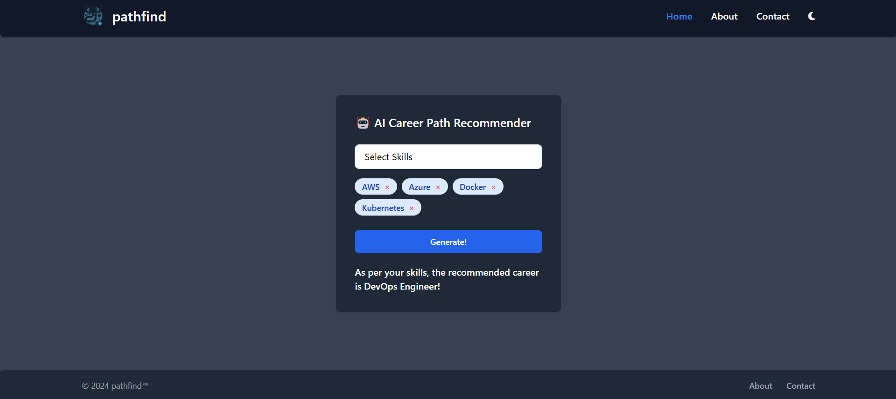

# AI Career Recommender System using Flask, Azure ML, Azure Logic Apps, Azure Static Web Pages

<!-- PROJECT LOGO -->
<br />
<div align="center">
    
    <h3 align="center">pathfind</h3>
    This project was created as part of a Azure Challenge at IITM to learn workflows of Azure ML Platform, Azure Logic Apps and Azure Static Web Pages. 
</div>

## Setup 

### 1. Python virtual environment for Testing

First we create the virtual environment and clone the repository into it. 
Then, we install all dependencies before running the application.
```sh
python3 -m venv /path/to/venv
cd /path/to/venv
git clone -b main https://github.com/priyanka-maz/AI-Career-Recommender
source bin/activate
cd AI-Career-Recommender
python3 -m pip install -r requirements.txt
python3 app.py
```

### 2. Azure ML Studio Resource Setup

- Create a Azure resource group within which you will create all the resources for efficient management.

- Create an Azure ML Workspace within this resource group. Check [this](https://learn.microsoft.com/en-us/azure/machine-learning/quickstart-create-resources?view=azureml-api-2) documentation for reference.

- First we upload the dataset we want to work with to Azure ML Data Assets. I have created a tabular format data asset using [career_path_recommendations.csv](datasets/career_path_recommendations.csv) in this repository. Refer to [this](https://learn.microsoft.com/en-us/AZURE/machine-learning/how-to-create-register-datasets?view=azureml-api-1) for more information.

    

- For model building, I have used an Automated ML Job to generate the best model. Since career recommendation is a classification task, I decided to use AUC_weighted as the primary metric for scoring the models. A cross-validation split of 5 folds is used for training over an 80-20 train-test set. 

    The best model selected is the Logistic Regression Model with Standard Scaler. Details of the model are available [here](models/).

    

- Post model building and training, the suitable model needs to be registered. Refer to this [page](https://learn.microsoft.com/en-us/azure/machine-learning/how-to-manage-models?view=azureml-api-2&tabs=cli) for more information.

- For model inference, an endpoint to access the model and send data to the model needs to be created. I have used a real-time endpoint for this task. You can select the compute resource and instances as per your expected traffic requirements. 

- Enable Microsoft.PolicyInsights and Microsoft.Cnd to your Subscription Resource Provider for successful endpoint deployment.

- This REST endpoint and its associated primary key will be used in the Logic App.

### 3. Azure Logic Apps Resource Setup

- Create a Logic App Resource within the same resource group.

- I have used 3 components as shown below:

    

- The Flask Backend or Frontend can send a POST request to the trigger endpoint with the skills of the user. 

- An action endpoint will call the model endpoint with the skills of the user.

- The model inference will be returned as a request object with the recommended career.

- Replace `MODEL_ENDPOINT_URL` in `logic_app.json` and `app.py` fwith your own model endpoint.

- Replace `MODEL_ENDPOINT_PRIMARY_KEY` in `logic_app.json` with your own model endpoint's primary key.

### 4. Azure Static Web Apps Setup

- For local testing purposes, you can run `python app.py`. 

- For static web app deployment, changes are made to the static web app branch of this repository.

- POST requests are directly handled by the javascript engine in that branch.

- For static web app, create a static web app resource within the same resource group.

- You can directly link your Github repository with the web app pages to deploy the static web app. Refer to this [page](https://learn.microsoft.com/en-us/azure/static-web-apps/overview) for more information.

## Usage

- Select your relevant skills from the "Select Skills" dropdown in the Home page.

- Click on generate to generate your recommended career path.

## Screenshots



